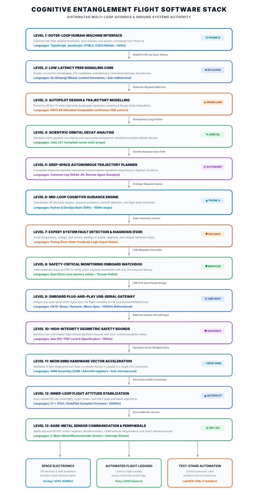

# Hierarchical Flight Control Architecture: Cognitive Entanglement 🛸📐

This document outlines the **aerospace-grade, distributed hierarchical flight control stack** of **Cognitive Entanglement**. As an aeronautical system, its control loops are segmented into distinct levels of authority to guarantee maximum **aerodynamic stability, memory-safety, sub-millisecond precision, and rapid reflex reactions**.

---

## 📐 Multi-Language Aerospace Flight Stack

---

## 🛠️ Level-by-Level Engineering Breakdown

### 1. CFD & Aerodynamic Analysis (Fortran 90)
*   **Platform**: Pre-flight high-performance computing arrays.
*   **Role**: Written in **Fortran 90** (`src/aerodynamic_drag_calculator.f90`) to perform double-precision numerical array calculations modeling parasitic aerodynamic drag forces under variable high-speed wind fields.

### 2. High-Performance Orbital Decay Predictor (Julia)
*   **Platform**: Pre-flight orbital research stations.
*   **Role**: Written in **Julia** (`src/orbital_decay_predictor.jl`) to utilize high-performance JIT-compiled matrix mathematics, simulating atmospheric densities and satellite orbital decay (altitude loss per orbit) over LEO orbits.

### 3. Space Electronics: Hardware Sensor Registers (Verilog & VHDL)
*   **Platform**: Onboard Field Programmable Gate Array (FPGA) logic gates.
*   **Role**: Written in **Verilog HDL** (`src/imu_sensor_reader.v`) and **VHDL** (`src/optical_encoder.vhd`) to implement physical SPI receivers and quadrature shaft decoders inside FPGAs to read telemetry with zero CPU overhead.

### 4. Bare-Metal: Direct Sensor Communication (C)
*   **Platform**: Microcontroller registers (STM32 / H7 series processors).
*   **Role**: Written in **C** to interface directly with physical sensors over SPI/I2C using direct memory access (DMA) transfers.

### 5. Inner-Loop: Attitude Stabilization & Motor Mixing (C++)
*   **Platform**: Flight Controller board (e.g., Pixhawk 6C) running PX4 or ArduPilot.
*   **Frequency**: **1000Hz**.
*   **Role**: This **C++** layer runs the **Extended Kalman Filter (EKF3)** for roll, pitch, yaw, and altitude estimates, and runs the nested PID attitude rate controllers.

### 6. Hardware-Accelerated Math: NEON SIMD Scaling (Assembly)
*   **Platform**: Onboard Phone A (64-bit ARM Cortex-A CPU).
*   **Role**: Written in **ARM Assembly (ASM)** (`src/vector_multiply.S`), this component leverages **AArch64 NEON SIMD** technology to load and multiply 4 single-precision float coordinates in parallel inside the CPU registers in a single instruction cycle.

### 7. High-Integrity Safety Boundaries: Geofence Limiter (Ada)
*   **Platform**: Onboard Flight Controller safety monitor.
*   **Role**: Written in **Ada** (`src/altitude_limiter.ads` & `.adb`) to meet rigorous **DO-178C Level A** safety standards. It implements a non-overridable, zero-exception altitude boundary clamp.

### 8. Onboard USB-to-Serial Transceiver (C#)
*   **Platform**: Onboard Phone A (via Android USB Host APIs / Xamarin Background Service).
*   **Role**: Written in **C#** (`src/OnboardUsbGateway.cs`) to utilize native Android USB Host ports. When you plug the flight controller into Phone A via a USB-OTG cable, this C# background service instantly bridges low-level serial packets directly to your local companion server.

### 9. Safety-Critical: Onboard Heartbeat Watchdog (Rust)
*   **Platform**: Onboard Companion Computer / "Drone Brain" (Phone A).
*   **Role**: Written in **Rust** (`src/failsafe_watchdog.rs`) to guarantee compile-time memory safety, zero-cost abstractions, and data-race-free multithreading. It acts as an isolated, high-integrity safety watchdog.

### 10. Expert System Fault Detection & Diagnosis (Prolog)
*   **Platform**: Onboard Companion Computer / "Drone Brain" (Phone A).
*   **Role**: Written in **Prolog** (`src/fault_diagnostics.pl`). It implements first-order predicate logic rules to create an autonomous **Failure Detection, Isolation, and Recovery (FDIR)** expert system. It fuses active current, voltage, and temperature sensor readings to isolate and flag structural failures in real-time.

### 11. Deep-Space Autonomous Trajectory Planner (Common Lisp)
*   **Platform**: Onboard Companion Computer / "Drone Brain" (Phone A).
*   **Role**: Written in **Common Lisp** (`src/orbital_planner.lisp`). Modeled after NASA JPL's historic Deep Space 1 Remote Agent architecture, it calculates and propagates analytical Keplerian orbital elements (eccentricity, anomalies, semi-major axis) over Earth tangent planes to plan autonomous orbital-sync paths.

### 12. Autopilot Design & Trajectory Modeling (MATLAB)
*   **Platform**: Off-line modeling ground station.
*   **Role**: Written in **MATLAB** (`src/simulate_trajectory.m`). It implements a 12-state rigid body quadcopter dynamics solver running continuous Runge-Kutta numerical integrations.

### 13. Mid-Loop: Cognitive Guidance & Safety Overrides (Python)
*   **Platform**: Onboard Companion Computer (**Phone A** mounted on the frame).
*   **Role**: Written in **Python**, this layer acts as the tactical navigator. It computes where the drone *should* fly safely, applying 3D blockade sensing and Exponential Moving Average (EMA) filtering.

### 14. Low-Latency WebRTC Signaling Core (Go)
*   **Platform**: Cloud Web server / Telemetry Broker.
*   **Role**: Written in **Go (Golang)** (`src/signaling_server.go`) to utilize high-concurrency **Goroutines** and mutex-locked maps to route WebRTC peer handshake packets with zero lag.

### 15. Ground Station Telemetry Logger (Ruby)
*   **Platform**: Ground Control telemetry stations.
*   **Role**: Written in **Ruby** (`src/telemetry_logger.rb`). It implements a lightweight, automated telemetry parsing and logging daemon that captures JSON flight packets, extracts variables, and writes structured, UTC-timestamped avionic logs.

### 16. Outer-Loop: Human-Machine Interface & Computer Vision (TypeScript & JavaScript)
*   **Platform**: Ground Station Browser / Pilot Phone (**Phone B**).
*   **Role**: Written in **TypeScript** (`src/telemetry_types.ts`) and **JavaScript** to run high-dimensional, heavy-lifting computer vision (MediaPipe JS) directly inside Phone B's web browser, rendering a real-time **SpaceX-styled Glass Cockpit HUD** with active roll, pitch, VSI vertical speed, and G-Force meters.

### 17. DevOps & Build Automation (Bash, Docker, & GNU Make)
*   **Platform**: Local development terminal or onboard Companion operating system.
*   **Role**: Written in **Bash** (`deploy.sh`), **Dockerfile**, and **Makefile** to fully automate environmental configuration, containerized microservice deployments, package dependency updates, and compile your high-integrity Rust, C++, and Go binaries.

---

## 🛡️ Multi-Tiered Failsafe Matrix

To prevent flyaways and guarantee aircraft survivability, the system implements hierarchical hardware/software failsafes:

1.  **Level 1 Failsafe (Autopilot / C++)**: If the serial cable between Phone A and the Pixhawk is severed, the Pixhawk immediately triggers an onboard **RC Failsafe**, automatically entering a stationary GPS hold or executing an RTL (Return-to-Land).
2.  **Level 2 Failsafe (Companion / Rust & Python)**: If the WebRTC connection or video call between Phone B and Phone A drops for over **1.5 seconds**, Phone A's Rust watchdog engine triggers a **Loss-of-Signal (LOS) Failsafe**, sending a MAVLink command to immediately hover or execute a controlled vertical descent.
3.  **Level 3 Failsafe (Ground / TypeScript & JS)**: If the browser's tab loses focus or frames stop rendering, the client automatically halts coordinate transmission, forcing Phone A to enter failsafe mode.
