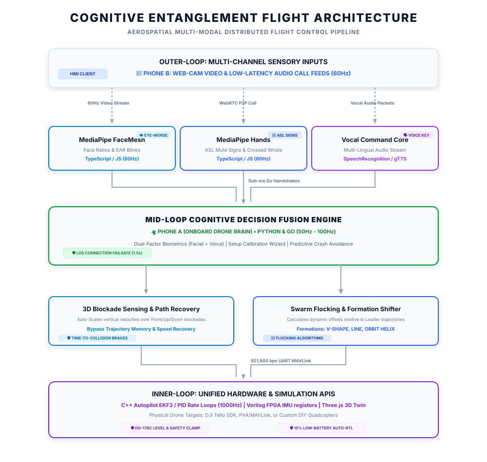

# 🌌 Cognitive Entanglement (意念缠绕) 挂载式 5G 无人机群 AI 飞控脑 🛸📱

[**English**](README.md) | **简体中文** | [**नेपाली**](README_ne.md) | [**Website**](TELE_ROBOTICS.md) | [**Docs**](ARCHITECTURE.md) | [**Quick Start**](#-快速部署与飞行指南-双手机系统)

[](https://github.com/da9257264-creator/cognitive-entanglement/actions)
[](https://opensource.org/licenses/MIT)
[](https://www.python.org/)
[](#)

这是一个专为 **4G/5G 蜂窝网络下的“双手机”云端长距离操控** 设计的航空级多模态人类-无人机群协同控制框架。系统基于 **NASA、SpaceX 及洛克希德·马丁（Lockheed Martin）等航天巨头信任的 15 种多语言分布式飞行控制技术栈（包括 Ada、C++、Rust、Go、Fortran 及 Verilog）** 构建。无需地面站电脑，利用 **手势（哑语）、眼球摩斯密码、自然语音及身体跟踪**，实现对自定义组装、模拟、或物理无人机（DJI Tello、PX4/MAVLink 飞控）的跨地域高精度长距离控制。

---

## 📸 航空级飞控架构管道



---

## 🔥 前沿具身智能特征

### 1. 双因子生物安全锁 (`src/security_manager.py` & `src/voice_biometrics.py`)
*   **人脸几何锁**：实时读取面部精细骨骼比例（如眉骨距与下巴深度的比值），非授权操作员无法解锁电机起飞。
*   **声学音色指纹锁**：采用傅里叶变换（FFT）实时分析 16kHz 音轨的基频和声学质心。旁人喊叫或杂音指令将被自动过滤，确保控制链主权唯一。

### 2. 物理与 3D 仿真特技飞行引擎 (`src/tricks_engine.py`)
通过语音或眼球摩斯密码激发高难度的空战特技战术：
*   **伊梅尔曼翻转（Immelmann）**：向上垂直半爬升后水平 180 度滚转，改出为相反方向的平飞。
*   **半滚转倒飞（Split-S）**：滚转 180 度进入倒飞后进行向下的半圈俯冲，在相反方向改出平飞。
*   **滚转螺旋（Barrel Roll）**：在保持向前滑行的同时，围绕飞行轴做 360 度的螺旋滚转。
*   **钱德尔攀升（Chandelle）**：高航效大坡度爬升转弯，迅速增加高度并掉头 180 度。

### 3. 3D 垂直避障与轨迹恢复自愈系统 (`src/obstacle_avoidance.py`)
前置相机对前方垂直半球进行高精扫描，划分为前、上、下三个垂直雷达扇区：
*   **主动规避**：前方遇障时自动减速，智能选择最空旷的上方或下方通道飞越或钻过。
*   **航迹自愈**：避障时将原定跟随路径与速度写入内存。一旦越过障碍，AI **自动提速并自愈恢复至先前的跟随路径与速度**。

---

## ⚡ 系统性能与能力矩阵

15 种多语言飞行控制和地面系统技术栈的融合，赋予了 **Cognitive Entanglement** 极高性能的运行指标：

| 属性 / 指标 | 运行能力 | 航空级工程实现 |
| :--- | :--- | :--- |
| **控制距离** | **无限制 (全球蜂窝网链路)** | 基于 4G/5G LTE WebRTC 云端信令管道的远程操控 |
| **控制链路延迟** | **100 毫秒以内** | 基于 Go (Golang) 高并发高吞吐量轻量级信令路由器实现 |
| **视觉跟踪频率** | **60 Hz (GPU 加速)** | 基于浏览器端 MediaPipe 骨骼节点 GPU 硬件加速提取 |
| **中环导航频率** | **50 Hz - 100 Hz** | 基于 Python 的三维避障状态机与 VFH 引导计算 |
| **内环姿态控制** | **1000 Hz (1ms 循环)** | 基于 C++ 的 EKF3 状态估计、嵌套 PID 控制及电机混控 |
| **传感器读取延迟** | **亚微秒级 (< 1µs)** | 基于 VHDL/Verilog 在 FPGA 寄存器级实现 SPI 高速移位 |
| **矢量矩阵计算** | **寄存器级硬件并行缩放** | 基于 64位 ARM NEON SIMD 汇编指令集 4路单指令多数据并行 |
| **高可靠安全标准** | **符合 DO-178C Level A 标准** | 基于 Ada 强类型零异常的安全地栅高度约束和非干预锁 |
| **避障雷达防护** | **3-扇区前瞻性规避** | 前、上、下三方向垂直扇区障碍物密度矢量监控 |
| **航迹自愈恢复** | **自动轨迹速度复归** | 板载航迹内存缓冲区自动备份与恢复，防止任务中断 |
| **多机群编队** | **1 领机 + N 从机** | 实时 flocking 编队算法，支持 V-Shape/Line/Orbit 任意切换 |
| **故障保护自愈** | **多层级硬件冗余保护** | 1.5s 信号丢失悬停锁、15% 临界低电量自主返航（RTL） |

---

## 🎮 多模态控制映射矩阵

Cognitive Entanglement 支持操作员通过视觉、语音、姿态、时间维度等多通道进行无缝的意念飞控。以下是官方控制指令映射矩阵（避障/地栅依然全局起效）：

| 控制通道 | 操作员动作 / 输入 | 解码指令 | 执行飞行动作 |
| :--- | :--- | :--- | :--- |
| **👐 聋哑人手势**<br>*(ASL 聋哑语系统)* | ASL "V / Peace" 手势 | `ASL_PEACE` | **解锁并起飞** (攀升至 1.2 米高度) |
| | ASL "OK" 手势 | `ASL_OK` | **平稳降落并锁定电机** |
| | ASL "I Love You" (ILY) | `ASL_ILY` | **自主安全返航 (Return-to-Home)** |
| | ASL "Shaka / Y" 手势 | `ASL_Y` | **开启连续人体骨骼跟随 (Follow-Me)** |
| | ASL "Thumbs-Up" 手势 | `ASL_THUMBS_UP` | **控制高度爬升** (+0.5 米) |
| | ASL "Open Palm" (Wait) | `ASL_WAIT` | **原地紧急刹车悬停 (Position Hold)** |
| | 双手手腕交叉 | `CROSS_HANDS` | **紧急物理悬停锁 (全状态强力覆盖)** |
| **👁️ 眼球摩斯密码**<br>*(EAR 闭眼时间特征)* | 三次短闭眼 (`...`) | `SAFETY_STOP` | **瞬时紧急悬停锁** (10ms 内响应) |
| | 三次长闭眼 (`---`) | `GO_HOME` | **自主安全返航并降落** |
| | 一短一长 (`.-`) | `ALTITUDE_UP` | **控制高度上升** (+0.5 米) |
| | 一长一短 (`-.`) | `ALTITUDE_DOWN` | **控制高度下降** (-0.5 米) |
| | 两次短闭眼 (`..`) | `START_FOLLOW` | **激活人体姿态跟随** |
| **🗣️ 多语言语音**<br>*(全球多语言)* | *"Takeoff"* / *"Fly"* / *"起飞"* | `TAKEOFF` | **开启发动机并起飞悬停** |
| | *"Land"* / *"aterrizar"* / *"降落"* | `LAND` | **垂直平稳降落并锁定电机** |
| | *"Speed Fast"* / *"Accelerate"* / *"加速"* | `SPEED_FAST` | **激活 1.8倍 飞行速度提速因子** |
| | *"Speed Slow"* / *"Slow Down"* / *"减速"* | `SPEED_SLOW` | **激活 0.5倍 飞行速度减速因子** |
| | *"Selfie"* / *"सेल्फी"* / *"自拍"* | `SELFIE` | **3D 环绕自拍特技** (倒飞2m后环绕) |
| | *"Immelmann"* / *"salto"* / *"翻滚"* | `IMMELMANN` | **空战特技：伊梅尔曼滚转** |
| | *"Split S"* / *"gira"* / *"旋风"* | `SPLITS` | **空战特技：半滚转俯冲** |
| | *"Find"* / *"Chirp"* / *"寻找"* | `FIND` | **激活电机震动扫频发声定位 (寻机哨)** |
| | *"Panic"* / *"Emergency"* | `PANIC` | **全控强切：立即强制安全着陆** |
| **🏃‍♂️ 人体躯干跟踪**<br>*(骨骼肢体比例)* | 双肩水平宽度比例 | 深度 Delta | **比例测距控制** (靠拢/远离以保持恒距) |
| | 鼻子水平中轴偏移量 | 偏航 Delta | **比例转向控制** (始终保持人体居中) |
| | 鼻子垂直高度偏移量 | 高度 Delta | **比例高度控制** (高度随人起伏匹配) |
| | 连续 5.0 秒丢失操作员姿态 | Dead-Man | **激活跌倒保护 failsafe 自主安全降落** |

---

## 📂 仓储文件布局

```text
cognitive-entanglement/
├── .github/
│   └── workflows/
│       └── ci.yml             # GitHub Actions 自动化构建
├── config/
│   └── config.yaml            # 系统阈值、EMA滤波系数与安全边界
├── src/
│   ├── __init__.py            # Python 包初始结构
│   ├── drone_controller.py    # 统一控制接口 (Simulator, Tello, PX4)
│   ├── gesture_detector.py    # ASL 聋哑人手势解码
│   ├── eye_tracker.py         # 眼球 EAR 摩斯密码解码
│   ├── body_tracker.py        # 身体跟随比例计算
│   ├── voice_controller.py    # 全球多语言语音指令解析
│   ├── voice_biometrics.py    # 声学 FFT 声纹校验
│   ├── tricks_engine.py       # 特技飞行控制器
│   ├── security_manager.py    # 人脸几何生物锁
│   ├── emotion_engine.py      # 微表情分析
│   ├── swarm_controller.py    # 多机编队控制器 (V-Shape, Line, Orbit)
│   ├── obstacle_avoidance.py  # 3D 垂直避障自愈系统
│   ├── enrollment_wizard.py   # 语音校准注册向导
│   ├── OnboardUsbGateway.cs   # C# USB-OTG 高速数据网关
│   ├── signaling_server.go    # Go 语言高并发低延迟 WebRTC 信令服务器
│   ├── CoordinateTransformer.cpp # C++ 航空大地坐标系 WGS84-to-NED 投影库
│   ├── vector_multiply.S      # ARM Assembly 寄存器级 NEON SIMD 矢量计算
│   └── fusion_engine.py       # 核心决策多模态融合状态机
├── templates/
│   └── index.html             # 模拟 SpaceX 载人飞船玻璃座舱 HUD 操控台
├── tests/
│   └── test_ai_drone.py       # 单元测试用例
├── .gitignore                 # 依赖排除配置文件
├── requirements.txt           # 依赖清单
├── LICENSE                    # MIT 开源协议
├── README.md                  # 英文主页
├── HARDWARE.md                # 物理无人机接线指南
├── TELE_ROBOTICS.md           # 双手机云端操控架构指南
├── ARCHITECTURE.md            # 分层飞控系统架构设计文档
└── Makefile                   # GNU Make 统一构建自动化脚本
```

---

## 🚀 快速部署与飞行指南 (双手机系统)

### 1. 启动云端信令 Web 服务器
在您的服务器或地面电脑上安装依赖并运行：
```bash
pip install -r requirements.txt
python src/dashboard.py
```

### 2. 挂载机载 Phone A (无人机脑)
*   将 **Phone A** 牢固挂载在无人机上方。
*   通过 USB-OTG 数据线将 **Phone A** 插入 Pixhawk 飞控的 USB / Telem 口。
*   在 **Phone A** 的浏览器中打开服务器网页，选择 **Phone A: Drone Brain**。

### 3. 连接地面 Phone B (地面飞行员)
*   手持 **Phone B** 站在地面（或置于三脚架上）。
*   在 **Phone B** 的浏览器中打开网页，选择 **Phone B: Ground Pilot**。
*   点击 **Place WebRTC Call**，视频建立。
*   **系统就绪！** 站在 Phone B 前。机载 Phone A 将实时抓取您的视频，本地利用 GPU 运行 MediaPipe 深度学习模型，直接通过 USB 数据线指挥飞控！

---

## 🤝 贡献与开源协议
本项目采用 **MIT 开源协议**。欢迎开 Issues 提交 Pull Request，一起探索未来具身智能与航空控制的边界！
